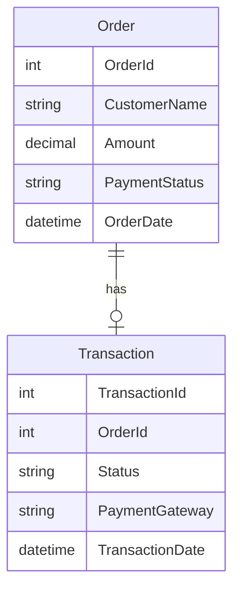

# CCAvenue Integration Project

This project demonstrates the integration of the **CCAvenue** payment gateway into an ASP.NET web application. It provides a ready-to-use framework for online payments, handling payment requests, responses, and transaction status updates via CCAvenue.

---

## Features

- **CCAvenue Payment Integration:** Initiate and process payments using CCAvenue gateway.
- **Secure Transaction Handling:** Encrypts and decrypts sensitive payment data as per CCAvenue requirements.
- **Order Management:** Stores and tracks transaction/order status.
- **Callback Handling:** Processes CCAvenue's response and updates order/payment status.
- **Error Handling:** Displays and logs any payment and gateway errors.

---

## Technologies Used

- **ASP.NET Web Forms:** Classic `.aspx` pages for UI and backend logic.
- **C#:** Handles payment request, response, encryption/decryption, and order processing.
- **CCAvenue API:** Integration with CCAvenue payment gateway.
- **SQL Server:** (optional) For storing transaction/order data.

---

## Typical Workflow

1. **Initiate Payment:** User chooses to pay, and the application prepares the request for CCAvenue (including merchant ID, order details, and amount).
2. **Encryption:** Payment request data is encrypted using CCAvenue’s provided working key and algorithm.
3. **Redirect to CCAvenue:** The user is redirected to CCAvenue’s payment page to complete the transaction.
4. **Callback/Response:** CCAvenue redirects back to your site with encrypted transaction response.
5. **Decryption & Processing:** The application decrypts the response, updates order/payment status, and displays appropriate messages to the user.

---

## Example Integration (Pseudocode)

```csharp
// Prepare payment request
string merchantId = "YOUR_MERCHANT_ID";
string orderId = "ORDER123";
string amount = "1000";
string workingKey = "YOUR_WORKING_KEY";
string redirectUrl = "https://yourdomain.com/CCAvenueResponse.aspx";

// Encrypt request data
string encRequest = Encrypt(paymentData, workingKey);

// Post to CCAvenue payment URL
Response.Redirect("https://secure.ccavenue.com/transaction/transaction.do?command=initiateTransaction");
```

---

## Data Model (ER Diagram Example)



---

## Getting Started

1. Clone the repository.
2. Configure your CCAvenue merchant credentials and working key.
3. Update callback URLs to point to your domain.
4. Run the application and initiate a test payment.
5. Verify successful integration and transaction status updates.

---

## License

This project uses CCAvenue's integration kit and guidelines. Please consult CCAvenue's documentation for compliance and usage restrictions.

---

## Author

Ashish Saurav

---

## Contributing

Pull requests and feedback are welcome.
